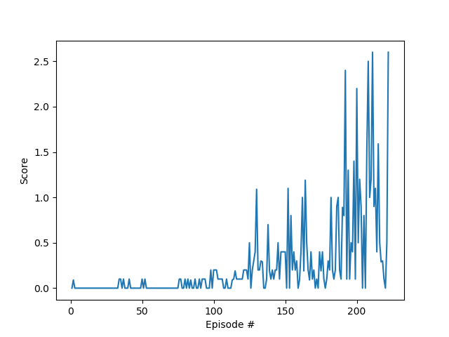
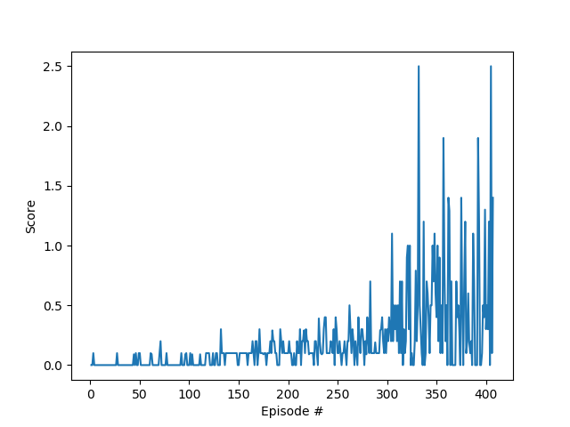
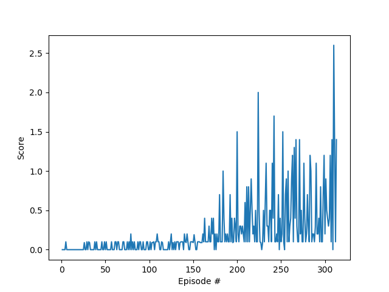

## DRL - DDPG Algorithm - Reacher Continuous Control

### Model Architecture
This is one implementation of mine from the MADDPG in PyTorch. The Udacity provided DDPG code was used as a reference.

The algorithm uses two deep neural networks (actor-critic) with the following structure:
- Actor    
    - Hidden: (input, 512)  - ReLU
    - Hidden: (512, 256)    - ReLU
    - Output: (256, 2)      - TanH

- Critic
    - Hidden: (input, 512)              - ReLU
    - Hidden: (512 + action_size, 256)  - ReLU
    - Output: (256, 1)                  - Linear

### Hyperparameters
- Learning Rate:
    - Actors: 1e-4
    - Critic: 3e-4
- Batch Size: 128
- Replay Buffer: 1e6
- Gamma: 0.99
- Tau: 2e-1
- Ornstein-Uhlenbeck noise parameters (0.15 theta and 0.2 sigma.)

## Results and Future Work
The actual model got the following results in 3 attempts.

I tried everything that I could for this scenery talking about the algorithm, so for a future goal, I plan to improve the 
neural network architecture and check if the results get better.
I feel that the convergence is still unstable although the good results. I think that with a better neural
network structure, the results could be more stable even with the stochastic factor within the problem.
